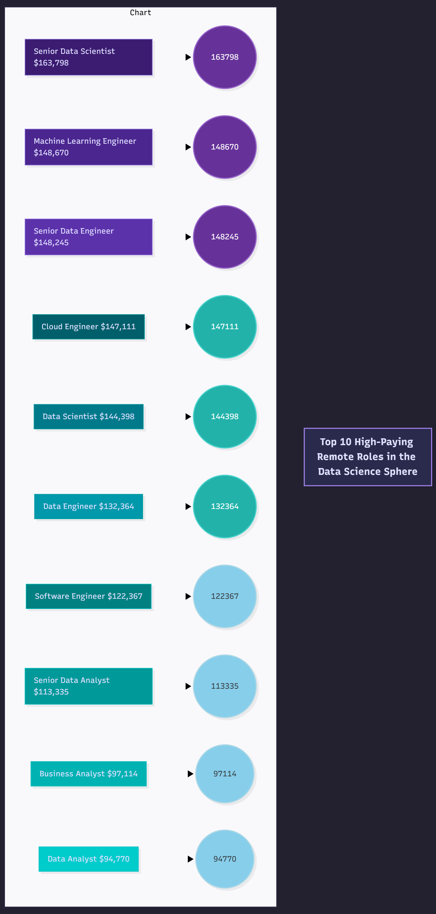

## INTRODUCTION

▌1. Introduction:
Dive into the data job market! Focusing on data analyst roles, this project explores & top-paying jobs, in-demand skills, and where high demand meets high salary in data analytics.
SQL queries + source database? Check them out here: 

Hope u find it interesting :) 


## BACKGROUP

Driven by a quest to navigate the data analyst job
market more effectively, this project was born
from a desire to pinpoint top-paid and in-demand
skills, streamlining others work to find optimal
jobs.

#### The questions I wanted to answer through my
SQL queries were:

1. What are the top-paying data analyst jobs?
2. What skills are required for these top-paying
  jobs?
3. What skills are most in demand for data
  analysts?
4. Which skills are associated with higher
  salaries?
5. What are the most optimal skills to learn?

## Tools I Used
For my deep dive into the data analyst job market,
I harnessed the power of several key tools:

- **SQL**: The backbone of my analysis, allowing me to
 query the database and unearth critical insights.
- **PostgreSQL**: The chosen database management
 system, ideal for handling the job posting data.
- **Visual Studio Code**: My go-to for database
 management and executing SQL queries.
- **Git & GitHub**: Essential for version control and
 sharing my SQL scripts and analysis, ensuring
 collaboration and project tracking.

# The Analysis
Each query for this project aimed at investigating
specific aspects of the data analyst job market.
Here's how I approached each question:

▌2. Top Paying Data Science /Analytics /Engineering Jobs
To identify the highest-paying roles, I filtered
data science positions by average yearly salary
and location, focusing on remote jobs. This query
highlights the high paying opportunities in the
field.


sql code:


```sql
 SELECT job_title_short,
    
 ROUND(AVG(salary_year_avg), 0) AS average_year_salary_in_dollars
            

 FROM job_postings_fact

WHERE job_work_from_home = 'true'
    AND salary_year_avg IS NOT NULL

 GROUP BY job_title_short

 ORDER BY average_year_salary_in_dollars DESC

 LIMIT 10;
```




▌3. Top Skills (programming langauges, programs, etc) required for the best payed jobs

sql code:
```sql
------------------------------------------------------------------------
WITH second_cte AS
(-----------------------------------------------------------------------
WITH first_cte AS 
(
SELECT c.name AS company,
job_id,
    job_title,
        job_location,
            job_schedule_type,
                salary_year_avg,
                    job_posted_date

 FROM
job_postings_fact

 LEFT JOIN company_dim AS c
 USING (company_id)

 WHERE
job_title_short = 'Data Analyst' AND
job_location= 'Anywhere' AND
salary_year_avg IS NOT NULL

ORDER BY
salary_year_avg DESC

LIMIT 40 
)---------------------------------------------------------------
SELECT * 
    FROM first_cte

INNER JOIN skills_job_dim
USING (job_id)
)-----------------------------------------------------------------------
SELECT a.job_id, a.company,
          a.job_title AS title,
                a.salary_year_avg AS salary,
                    b.skills AS skill

FROM second_cte AS a
INNER JOIN skills_dim AS b
USING (skill_id)
```

;

 All in all, the top tier data analytic vacancies ask for a lot of skills as well as expertise I'm sure, when it comes to 
the skills I'll state here the top 5 vacancies and the skills they demand in a candidate


- Asociate director/ Data Analyst AT&T >>> sql, python, r, azure, databricks, aws, pandas, pyspark, jupyter, excel, tableau, power bi, powerpoint

- Data Analyst Pinterest >>> sql, python, r, hadoop, tableau

- Data Analyst Uclahealthcareers >>> sql, crystal, oracle, flow

- Principal Data Analyst SmartAsset >>> sql, python, go, snowflake, pandas, numpy, excel, tableaut, gitlab

- Director Data Analyst Inclusively	sql, python, oracle, snowflake, tableau, power bi, sap, jenkins,bitbucket, atlassian, jira,confluence


▌4. Top Skills (programming langauges, programs, etc) required for the best payed jobs

 most demanded skill for Data Analysis


```sql

SELECT c.skill_id AS id_skill,
     c.skills AS skill,
         COUNT (a.job_id) AS n_vacancies_where_required

FROM job_postings_fact AS a


INNER JOIN skills_job_dim AS b USING (job_id)
INNER JOIN skills_dim AS c USING (skill_id)

WHERE a.job_title LIKE '%Data Analyst%' OR a.job_title LIKE '%data analyst%'

GROUP BY c.skill_id
ORDER BY n_vacancies_where_required DESC
;

```


▌5.  Look at the average salary associated with each skill for Data Analyst positions
• Why? It reveals how different skills impact salary levels for Data Analysts and helps identify
the most financially rewarding skills to acquire or improve

```sql
 SELECT
     a.skills AS skills,
         ROUND(AVG(c.salary_year_avg),0) AS avg_salary


FROM skills_dim AS a
INNER JOIN skills_job_dim AS b USING (skill_id)
INNER JOIN job_postings_fact AS c USING (job_id)

WHERE (c.job_title LIKE '%Data Analyst%'
OR c.job_title LIKE '%data analyst%')
AND c.salary_year_avg IS NOT NULL


GROUP BY a.skills

ORDER BY avg_salary DESC
LIMIT 25;
```


▌6. Most optimal skills to learn. I'll combine the querries in order to have te relation between skills that are well payed and skills that are more in demand.
from file 4 and file 5 as CTEs

```sql

WITH most_used_skills AS (
        SELECT c.skill_id AS id_skill,
        c.skills AS skills,
            COUNT (a.job_id) AS n_vacancies_where_required

    FROM job_postings_fact AS a


    INNER JOIN skills_job_dim AS b USING (job_id)
    INNER JOIN skills_dim AS c USING (skill_id)

    WHERE a.job_title LIKE '%Data Analyst%' OR a.job_title LIKE '%data analyst%'

    GROUP BY c.skill_id
), best_payed_skills AS (
    SELECT
     a.skills AS skills,
         ROUND(AVG(c.salary_year_avg),0) AS avg_salary


FROM skills_dim AS a
INNER JOIN skills_job_dim AS b USING (skill_id)
INNER JOIN job_postings_fact AS c USING (job_id)

WHERE (c.job_title LIKE '%Data Analyst%'
OR c.job_title LIKE '%data analyst%')
AND c.salary_year_avg IS NOT NULL


GROUP BY a.skills


)
SELECT *
FROM most_used_skills
INNER JOIN best_payed_skills
USING (skills)
ORDER BY n_vacancies_where_required DESC, avg_salary DESC;

```


# WHAT I LEARNT

Throughout this adventure, I've turbocharged my SQL toolkit with some serious firepower:
-***Complex Query Crafting:** Mastered the art of advanced SQL, merging tables like a pro and wielding WITH clauses for ninja-level temp table maneuvers.
**Data Aggregation:** Got cozy with GROUP BY and turned aggregate functions like COUNT() and AVG () into my data-summarizing sidekicks. Į
- **Analytical Wizardry:** Leveled up my real-world puzzle-solving skills, turning questions into actionable, insightful SQL queries.


### Insights
1. **Top-Paying Data Analyst Jobs**: The highest-paying jobs for data analysts that allow remote work offer a wide range of salaries, the highest at $650,000!
2. **Skills for Top-Paying Jobs**: High-paying data analyst jobs require advanced proficiency in SQL, suggesting it's a critical skill for earning a top salary.
3. **Most In-Demand Skills**: SQL is also the most demanded skill in the data analyst job market, thus making it essential for job seekers.
4. **Skills with Higher Salaries**: Specialized skills, such as SVN and Solidity, are associated with the highest average salaries, indicating a premium on niche expertise.
5. **Optimal Skills for Job Market Value**: SQL leads in demand and offers for a high average salary, positioning it as one of the most optimal skills for data analysts to learn to maximize their market value.


# CONCLUSION


This project enhanced my SQL skills and provided valuable insights into the data analyst job market. The findings from the analysis serve as a guide to prioritizing skill development and job search efforts. Aspiring data analysts can better position themselves in a competitive job market by focusing on high-demand, high-salary skills. This exploration highlights the importance of continuous learning and adaptation to emerging trends in the field of data analytics

